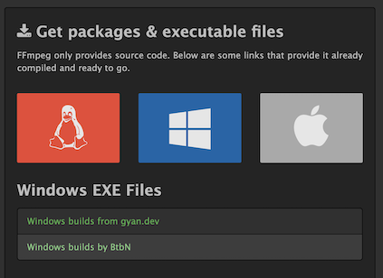
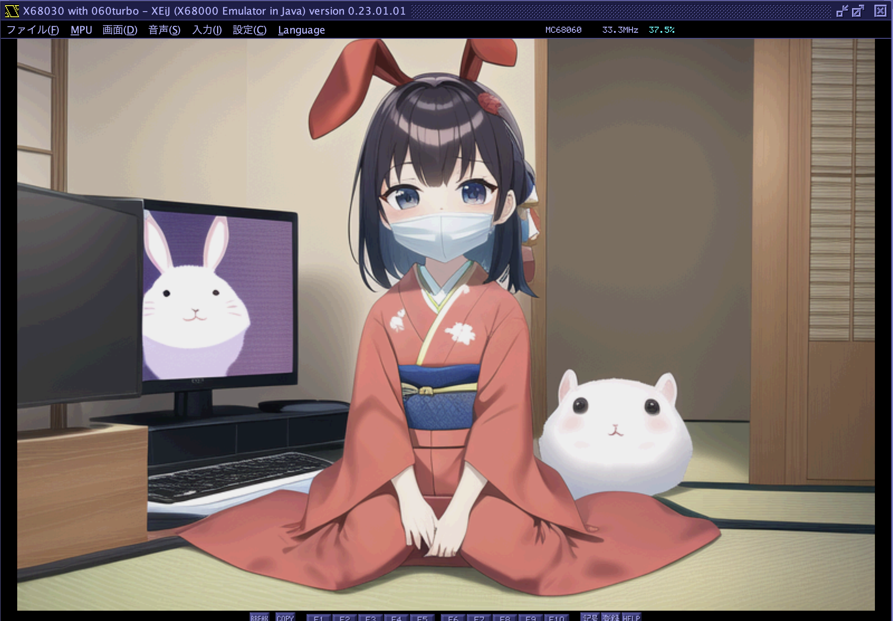
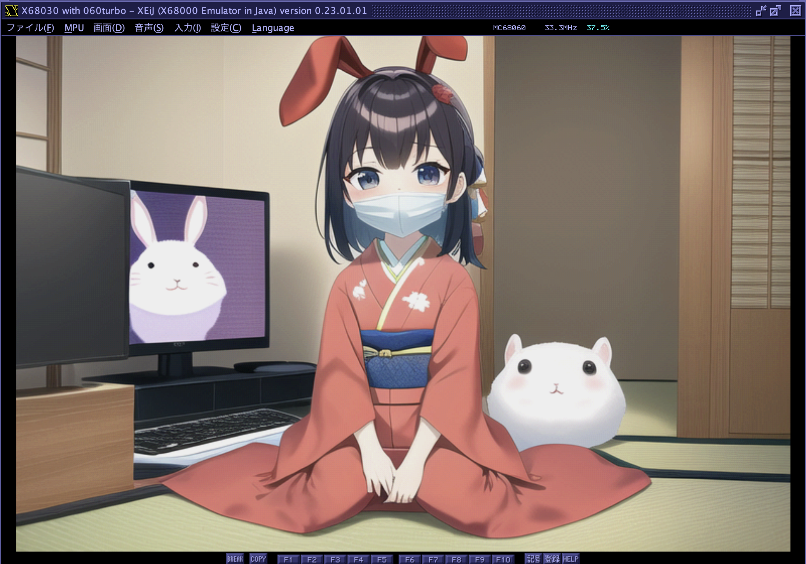
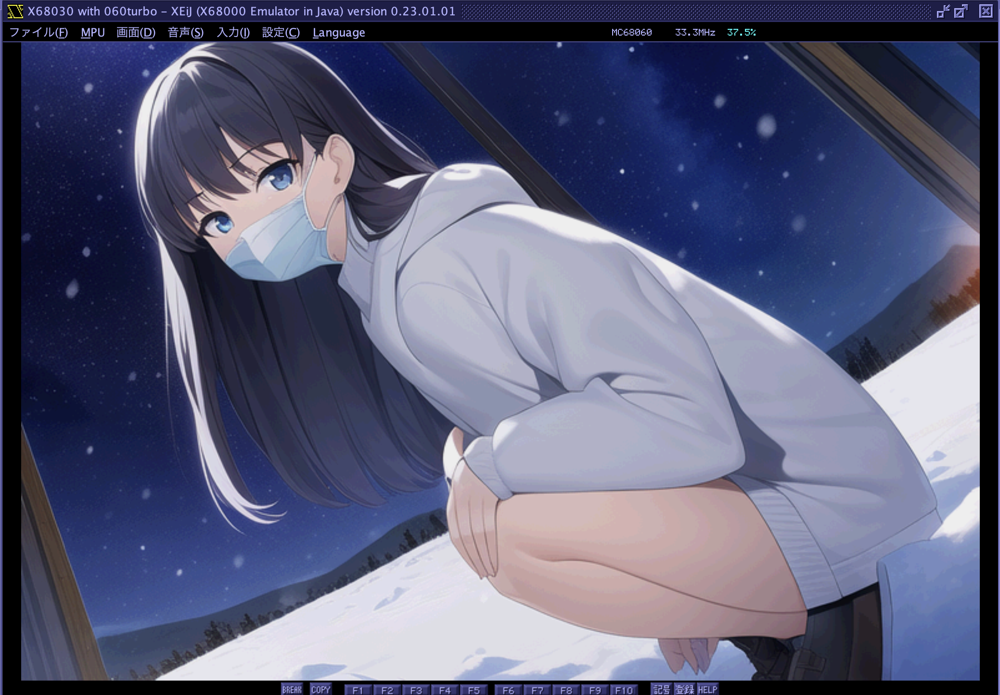
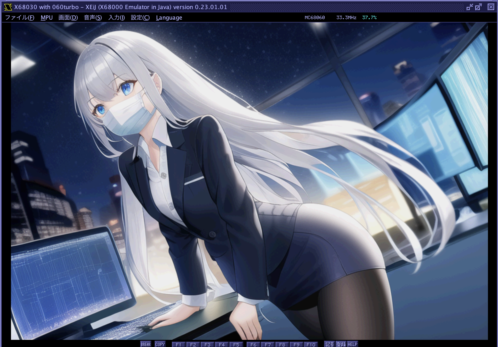
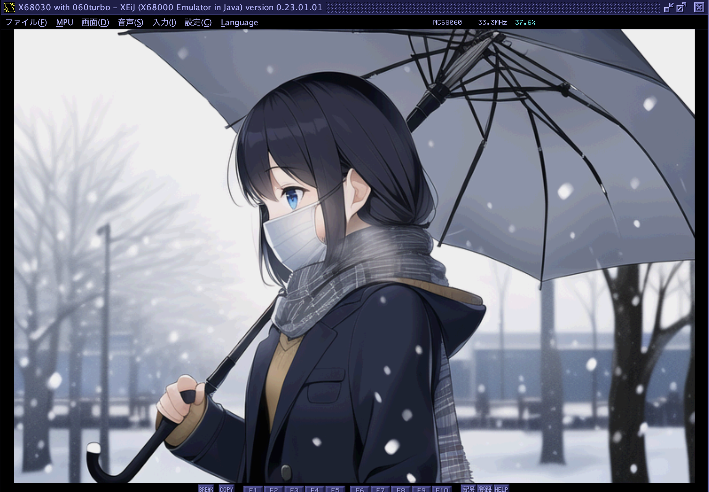
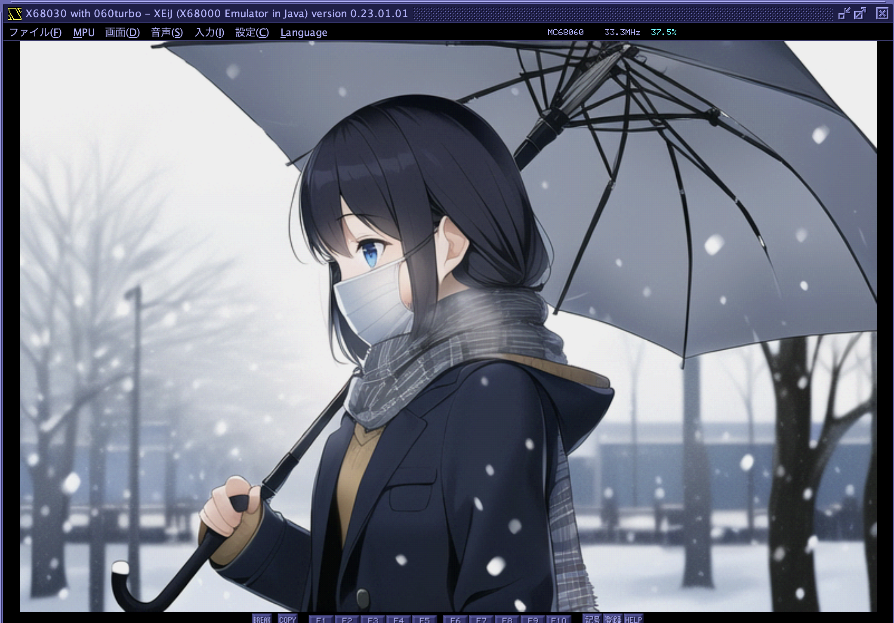

# pngdeband
24bit/32bit PNG to 15bit PNG converter with de-banding filter in Python

24bit/32bit RGB/RGBA の PNG ファイルを X680x0 で表示するのに適した 15bit color の PNG に変換します。
この時、単純に RGB 各 8bit の下位 3bit を落として 24bit から 15bit に変換してしまうと、
画像の中で平坦かつ明暗差がある部分で band(マッハバンド)がすごく目立ちます。
これを防ぐために deband (マッハバンド除去) をしつつ 15bit に変換し、新たな PNG ファイルとして出力します。

PNG ファイルはその仕様上 15bit のビット深度はサポートされていませんので 24bit RGB PNG として出力しますが、
使われているカラーは 15bit 分のみ、下位3bitはすべて0になっています。

---

### 準備: ffmpeg のインストール (Windows)

インストールにあたっては、オープンソースの動画処理コマンドラインツール `ffmpeg` の導入が必要になります。

Windowsの場合は公式サイト [https://ffmpeg.org/](https://ffmpeg.org/) に行き、Get packages & executable files を選びます。

下の方のサイト(BtbN)が分かりやすいのでそちらから、

    ffmpeg-master-latest-win64-gpl-shared.zip

をダウンロードします。Windowsインストーラ形式にはなっていないので、zipファイルを自分の希望する場所に展開します。
その後で bin フォルダを環境変数 PATH に追加してください。

ググると詳細な導入説明サイトが沢山ありますので、それらも参考にしてください。

---

### 準備: ffmpeg のインストール (macOS)

    brew install ffmpeg

だけです。

---

### pngdeband のインストール

pip を使って導入します。

    pip uninstall ffmpeg

    pip install git+https://github.com/tantanGH/pngdeband.git

`ffmpeg` というライブラリがもし入っていた場合、これをアンインストールする必要があります。非常に紛らわしいですが、このライブラリは使えません。
`pngdeband` をインストールすると `ffmpeg-python` という本来のラッパーライブラリが導入されます。

[Windowsユーザ向けPython導入ガイド](https://github.com/tantanGH/distribution/blob/main/windows_python_for_x68k.md)

---

### 使い方

    pngdeband [options] <input-png-file> <output-png-file>

    options:
      -h, --help                        ... ヘルプメッセージの表示
      -x WIDTH, --width WIDTH           ... 画像を縮小する際の幅をピクセルで指定 height の指定がないと元アスペクト比が維持されます
      -y HEIGHT, --height HEIGHT        ... 画像を縮小する際の高さをピクセルで指定 width の指定がないと元アスペクト比が維持されます
      -r RESIZE, --resize RESIZE        ... 画像を縮小する際の大きさをパーセントで指定 (-x,-yがあればそちらが優先されます)
      -t1 THRESHOLD1, --threshold1 THRESHOLD1
                        debanding detection threshold for channel 1 (default:0.02)
      -t2 THRESHOLD2, --threshold2 THRESHOLD2
                        debanding detection threshold for channel 2 (default:0.02)
      -t3 THRESHOLD3, --threshold3 THRESHOLD3
                        debanding detection threshold for channel 3 (default:0.02)
      -bl BLUR, --blur BLUR
                        1:check with average of 4 pixels 0:check with all 4 pixels (default:1)

`-t1` `-t2` `-t3` `-bl` については基本的にデフォルトのままで大丈夫かと思います。
期待通りの結果が得られない場合のみ調整してみてください。

---

### 変換例1

変換前の24bitPNGをdeband処理なしで15bit表示したもの。
全体的にbandが目立ちます。

deband処理して15bit表示したもの。
紫色のディスプレイについてはbandではなくもともとそういうテクスチャなので、それは維持されています。

---

### 変換例2

変換前の24bitPNGをdeband処理なしで15bit表示したもの。
画面右側の空や太ももの部分にbandが目立ちます。

deband処理して15bit表示したもの。
ほぼ解消されています。

---

### 変換例3

変換前の24bitPNGをdeband処理なしで15bit表示したもの。
レギンスや画面右側の背景にbandが目立ちます。

deband処理して15bit表示したもの。
解消されています。

---

### 変換例4

変換前の24bitPNGをdeband処理なしで15bit表示したもの。
傘の内側の部分にbandが目立ちます。制服にも少しあります。

deband処理して15bit表示したもの。
解消されています。

---

### NOTIFICATION

This software is relying on the below awesome softwares. Thanks.

* FFmpeg - A complete, cross-platform solution to record, convert and stream audio and video. https://ffmpeg.org/
* Python bindings for FFmpeg - with complex filtering support https://github.com/kkroening/ffmpeg-python/
